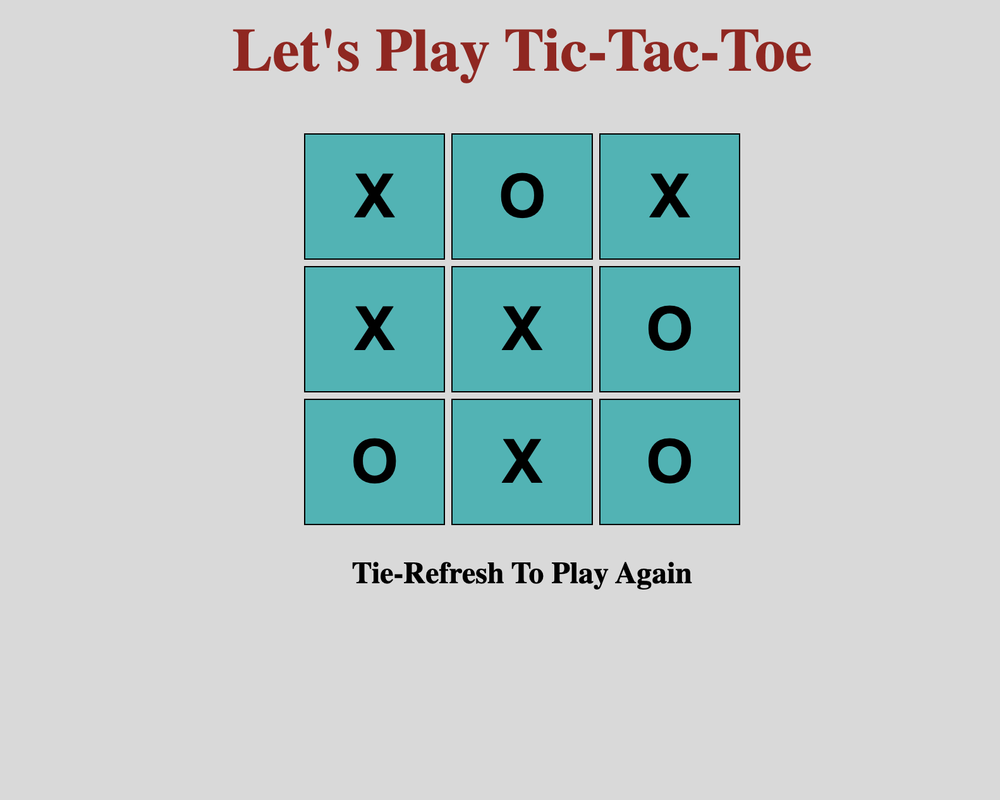

# My Tic-Tac-Toe project
My Tic-Tac-Toe is a game played by two players X and O and each one has a turn. If a player matches 3 cells being in a row, column or diagonal, the roundCompleted function says that the player won the game. 

## How It's Made: 

This game is made using HTML, CSS, and JavaScript

## Lessons Learned:

I learned how to use arrays, variables, conditions and functions in JavaScript and most importantly the logic behind the winning functions.

Find the live project here https://innocent-r.github.io/tic-tac-toe/

